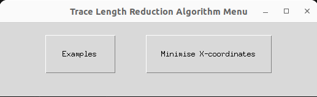
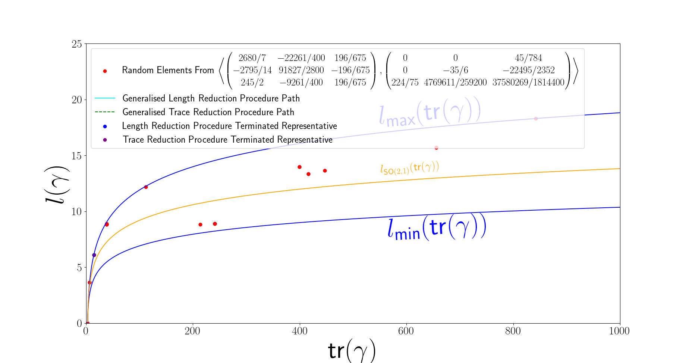

# Trace-Length Reduction Algorithm Implementation

The extended algorithms for length and trace reduction on convex projective surfaces are presented in this repository. Their implementations are done symbolically through the [SymPy](https://www.sympy.org/en/index.html) library. The only potential technical issue lies in the calculation of the eigenvalues for 3 x 3 matrices, which relies on the cubic root formula in the SymPy implementation. This means that the eigenvalues will be rounded to a certain precision, although this can be set arbitrarily high in the implementation.

## Installation

To install, run the following code. This will install the trace_length_reduction pip package, including its dependencies. If this does not work, the dependencies listed in `setup.py` can be installed separately.

```
python3 -m pip install -e .
```

## Running

To run, run the following code:

```
python3 main.py
```

## Usage

After running, a visual interface appears as shown below.




<!-- 
## Installation

To install, run the following:

```
pip3 install numpy sympy matplotlib 
```

To visualise the eigenvalue plots with LaTeX rendered labels, a LaTeX distribution is expected to be installed on the host machine for these lines to correctly execute in the `plot_eigenvalues_and_traces` function. 

```
mpl.rcParams.update(mpl.rcParamsDefault)
plt.rcParams['text.usetex'] = True
mpl.rcParams['text.latex.preamble'] = r'\usepackage{{amsmath}}'
```

If a LaTeX distribution is not available, one can comment out the `plot_eigenvalues_and_traces` function call to run the algorithm nonetheless.
 -->


<!-- ## Running

To run, do the following:

1. Either input custom random integers into the 16 x 1 vector `random_integers`, or comment it out to allow the random number generator to produce numbers in the range 1 to 10 from the `np.random.randint(1,10)` function call. By default, integers corresponding to an infinite volume torus will override the randomly generated integers.

After this step, the integers will be divided in the respective order to form 8 rationals, i.e. if a precedes b, then the rational will be a/b.

To obtain the X-coordinates, the rationals will be cubed and their cube roots will be implicitly kept as the original rationals. These are then fed into the `compute_translation_matrix_torus` function that returns the holonomy representations A, B of the canonical generators of the once-punctured torus. 

2. Run the following command:

```
python3 trace_and_length_minimisation_x_coordinates.py
```

After running, the canonical generators A, B will be printed out in LaTeX code. Note that these are not necessarily ordered by length or trace.


## Example Output

An example output is given below.

```
A = \begin{pmatrix} 2680/7 & -22261/400 & 196/675 \\ -2795/14 & 91827/2800 & -196/675 \\ 245/2 & -9261/400 & 196/675 \end{pmatrix}
B = \begin{pmatrix} 0 & 0 & 45/784 \\ 0 & -35/6 & -22495/2352 \\ 224/75 & 4769611/259200 & 37580269/1814400 \end{pmatrix}
----TRACE REDUCTION RESULTS----
X coordinates: (27/64, 64/125, 1/27, 1/8, 64, 8/729, 512, 343/216)
Returned Generators: (A**(-1)*B**(-2), B)
tr(A'): 38.2463556393753 
 length(A'): 8.894979024798719 
 tr(B'): 14.8788960537919 
 length(B') 6.0971426427870945 
 tr(A'B'): 213.743077256944 
 length(A'B'): 8.830449300570177 
 tr(A'(B')^(-1)): 22542.3671974710 
 length(A'(B')^(-1)): 13.628387245969911 
 tr([A',B']): 8.89464378231817 
 length([A',B']): 3.6252814640259485
---------------------------------
----LENGTH REDUCTION RESULTS----
X coordinates: (27/64, 64/125, 1/27, 1/8, 64, 8/729, 512, 343/216)
Returned Generators: (A*B, B)
tr(A'): 38.6984278549383 
 length(A'): 8.830449300570177 
 tr(B'): 14.8788960537919 
 length(B') 6.0971426427870945 
 tr(A'B'): 240.991665555194 
 length(A'B'): 8.894979024798719 
 tr(A'(B')^(-1)): 415.942870370370 
 length(A'(B')^(-1)): 13.350348049636759 
 tr([A',B']): 6.50421668661035 
 length([A',B']): 3.6252814640259485
---------------------------------
```

 -->